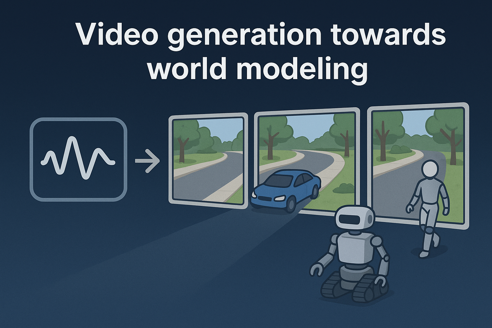

# Awesome From Video Generation to World Model




The field of video generation is undergoing a paradigm shift - from generating realistic and appealing visuals to constructing world models that can simulate interactive and navigable environments. These models are not just visual tools; they serve as testbeds for training and evaluating intelligent agents, such as robots, autonomous vehicles, or virtual avatars. A central goal is to enable agents to perceive, act, and plan within generated video scenarios as if they were interacting with the real world. We compile key works that push video generation toward actionable world modeling, focusing physical plausibility, and the capacity for agents to navigate, manipulate, and learn from these synthetic environments.

[](https://arxiv.org/abs/2511.08585)
[](https://world-model-roadmap.github.io/)
[](https://github.com/ziqihuangg/Awesome-From-Video-Generation-to-World-Model)

[](https://github.com/ziqihuangg/Awesome-From-Video-Generation-to-World-Model/pulls)


## Overview

This repository currently contains the paper list for "Video Generation towards World Model".

### What You'll Find Here

We hope to support the research and industrial communities by systematically collecting and organizing influential works that drive progress in video generation for world modeling.

### News :fire: 
- [06/2025] We are hosting CVPR 2025 Tutorial [From Video Generation to World Model](https://world-model-tutorial.github.io) on June 11!

### Updates

This repository is updated periodically. If you have suggestions for additional resources, updates on methodologies, or fixes for expiring links, please feel free to do any of the following:
- raise an [Issue](https://github.com/ziqihuangg/Awesome-From-Video-Generation-to-World-Model/issues),
- nominate awesome related works with [Pull Requests](https://github.com/ziqihuangg/Awesome-From-Video-Generation-to-World-Model/pulls),
- For other queries: email both Ziqi `ZIQI002 at e dot ntu dot edu dot sg` and Jingtong `yuejingtong137 at gmail dot com`.


### Table of Contents
- [1. Generation 1: Faithfulness - Accurate Simulation of the Real World](#1.)
    - [1.1 Video Foundation Model](#1.1.)
    - [1.2 Other Video Generation Model](#1.2.)
        - [1.2.1 GAN Based Video Generation](#1.2.1.)
        - [1.2.2 U-Net Based Video Generation](#1.2.2.)
        - [1.2.3 DiT Based Video Generation](#1.2.3.)
        - [1.2.4 Autoregressive Based Video Generation](#1.2.4.)
    - [1.3 Conditined World Model](#1.3.)
        - [1.3.1 Conditined World Model in General Scene](#1.3.1.)
        - [1.3.2 Conditined World Model in Robotics](#1.3.2.)
        - [1.3.3 Conditined World Model in Autonomous Driving](#1.3.3.)
        - [1.3.4 Conditined World Model in Gaming](#1.3.4.)

- [2. Generation 2: Interactiveness - Controllability and Interactive Dynamics](#2.)
  - [2.1 High-quality World Foundation Model](#2.1.)
  - [2.2 Video Generation as World Model in General Scene](#2.2.)
    - [2.2.1 Geometry Prior World Model](#2.2.1.)
    - [2.2.2 3D Prior World Model](#2.2.2.)
    - [2.2.3 Physical Prior World Model](#2.2.3.)
    - [2.2.4 Audio Driven World Model](#2.2.4.)
    - [2.2.5 Trajectory Navigation World Model](#2.2.5.)
    - [2.2.6 Camera Motion Navigation World Model](#2.2.6.)
    - [2.2.7 Instruction Navigation World Model](#2.2.7.)
    - [2.2.8 Action Navigation World Model](#2.2.8.)

  - [2.3 Video Generation as World Model in Robotics](#2.3.)
    - [2.3.1 Action Navigation World Model](#2.3.1.)
    - [2.3.2 Instruction Navigation World Model](#2.3.2.)
    - [2.3.3 Goal Navigation World Model](#2.3.3.)
    - [2.3.4 Hybrid Navigation World Model](#2.3.4.)
    - [2.3.5 Real-time Interactive World Model](#2.3.5.)

  
  - [2.4 Video Generation as World Model in Autonomous Driving](#2.4.)
    - [2.4.1 Layout Prior World Model](#2.4.1.)
    - [2.4.2 Instruction Navigation World Model](#2.4.2.)
    - [2.4.3 Trajectory Navigation World Model](#2.4.3.)
    - [2.4.4 Action Navigation World Model](#2.4.4.)
    - [2.4.5 Hybrid Navigation World Model](#2.4.5.)
    - [2.4.6 Other Navigation World Model](#2.4.6.)

      
  - [2.5 Video Generation as World Model in Gaming](#2.5.)
    - [2.5.1 Controller Navigation World Model](#2.5.1.)
    - [2.5.2 Action World Model](#2.5.2.)
    - [2.5.3 Hybrid Navigation World Model](#2.5.3.)
    
- [3. Generation 3: Planning - Modeling the Future Evolution of Complex Systems](#3.)
  - [3.1 Macroscopic Scale Planning World Model](#3.1.)
  - [3.2 Mesoscopic Scale Planning World Model](#3.2.)
  - [3.3 Microscopic Scale Planning World Model](#3.3.)

- [4. Generation 4: Randomness - Outlier Modeling](#4.)

- [5. Evaluation and Datasets](#5.)
    - [5.1 Evaluation Metrics of Video Generation](#5.1.)
    - [5.2 Evaluation Metrics of World Model](#5.2.)
    - [5.3 Datasets](#5.3.)
    
- [6. Study and Rethinking](#6.)
    - [6.1 Survey](#6.1.)
    - [6.2 Position](#6.2.)
 
- [7. Downstream Tasks for World Modeling](#7.)
    - [7.1 World Models as Data Generators](#7.1.)
    - [7.2 World Models as Reasoning Proxy](#7.2.)


<a name="1."></a>
# 1. Generation 1: Faithfulness - Accurate Simulation of the Real World
<a name="1.1."></a>
## 1.1 Video Foundation Model
|     Date     | Venue | Acronym | Paper | Project | Repo@GitHub | 
|--------------|-------|---------|-------|---------|-------------|
| 2024-12-30 | Arxiv | LTX-Video | [LTX-Video: Realtime Video Latent Diffusion](https://arxiv.org/abs/2501.00103) | [](https://www.lightricks.com/) | [](https://github.com/Lightricks/LTX-Video) |
| 2024-12-12 | Arxiv | Owl-1 | [Owl-1: Omni World Model for Consistent Long Video Generation](https://arxiv.org/abs/2412.09600) |  | [](https://github.com/huang-yh/Owl) |
| 2024-12-10 | Arxiv | STIV | [STIV: Scalable Text and Image Conditioned Video Generation](https://arxiv.org/abs/2412.07730) |  |  |
| 2024-09-24 |  | JT-CV |  | [](https://github.com/jiutiancv/JV-CV-T2V) |  |
| 2024-09 |  | Hailuo AI |  | [](https://hailuoai.video/) |  |
| 2024-06-06 |  | VideoTetris | [VideoTetris: Towards Compositional Text-to-Video Generation](https://arxiv.org/abs/2406.04277) | [](https://videotetris.github.io/) | [](https://github.com/YangLing0818/VideoTetris) |
| 2024-02-22 |  | Snap Video | [Snap Video: Scaled Spatiotemporal Transformers for Text-to-Video Synthesis](https://arxiv.org/abs/2402.14797) | [](https://snap-research.github.io/snapvideo/) |  |
| 2024-01-23 | Arxiv | Lumiere | [Lumiere: A Space-Time Diffusion Model for Video Generation](https://arxiv.org/abs/2401.12945) | [](https://lumiere-video.github.io/) |  |
| 2024-01-17 | CVPR24 | VideoCrafter2 | [Videocrafter2:Overcoming data limitations for high-quality video diffusion models](https://arxiv.org/abs/2401.09047) | [](https://ailab-cvc.github.io/videocrafter2/) | [](https://github.com/AILab-CVC/VideoCrafter) |
| 2024-01-09 | Arxiv | MagicVideo-V2 | [MagicVideo-V2: Multi-Stage High-Aesthetic Video Generation](https://arxiv.org/abs/2401.04468) | [](https://magicvideov2.github.io/) |  |
| 2024-01-05 | TMLR25 | Latte | [Latte: Latent Diffusion Transformer for Video Generation](https://arxiv.org/abs/2401.03048) | [](https://maxin-cn.github.io/latte_project/) | [](https://github.com/Vchitect/Latte) |
| 2023-12-07 | Arxiv | HiGen | [Hierarchical Spatio-temporal Decoupling for Text-to-Video Generation](https://arxiv.org/abs/2312.04483)  | [](https://higen-t2v.github.io/) | [](https://github.com/ali-vilab/VGen) |
| 2023-11-25 | Arxiv | SVD | [Stable Video Diffusion: Scaling Latent Video Diffusion Models to Large Datasets](https://arxiv.org/abs/2311.15127) |  | [](https://github.com/Stability-AI/generative-models) |
| 2023-11-07 | Arxiv | I2VGen-XL | [I2VGen-XL: High-Quality Image-to-Video Synthesis via Cascaded Diffusion Models](https://arxiv.org/abs/2311.04145) |  | [](https://github.com/ali-vilab/VGen) |
| 2023-10-31 | ICLR24 | SEINE |  [SEINE: Short-to-Long Video Diffusion Model for Generative Transition and Prediction](https://arxiv.org/abs/2310.20700)  | [](https://vchitect.github.io/SEINE-project/)  | [](https://github.com/Vchitect/SEINE) |
| 2023-10-30 | Arxiv | VideoCrafter1 | [Videocrafter1: Open diffusion models for high-quality video generation](https://arxiv.org/abs/2310.19512) | [](https://i2vgen-xl.github.io/)  | [](https://github.com/AILab-CVC/VideoCrafter) |
| 2023-10-18 | ECCV24 | DynamiCrafter |  [DynamiCrafter: Animating Open-domain Images with Video Diffusion Priors](https://arxiv.org/abs/2310.12190) | [](https://doubiiu.github.io/projects/DynamiCrafter)   | [](https://github.com/Doubiiu/DynamiCrafter) |
| 2023-10-09 | ICLR24 | MAGVIT-v2 |  [Language Model Beats Diffusion -- Tokenizer is Key to Visual Generation](https://arxiv.org/abs/2310.05737) |  |  |
| 2023-09-27 | IJCV24 | Show-1 | [Show-1: Marrying Pixel and Latent Diffusion Models for Text-to-Video ](https://arxiv.org/abs/2309.15818) | [](https://showlab.github.io/Show-1/) | [](https://github.com/showlab/Show-1) |
| 2023-09-26 | IJCV24 | LaVie | [LAVIE: High-Quality Video Generation with Cascaded Latent Diffusion Models](https://arxiv.org/abs/2309.15103) | [](https://vchitect.github.io/LaVie-project/) | [](https://github.com/Vchitect/LaVie) |
| 2023-09-01 | Arxiv | VideoGen | [VideoGen: A Reference-Guided Latent Diffusion Approach for High Definition Text-to-Video Generation](https://arxiv.org/abs/2309.00398) | [](https://videogen.github.io/VideoGen/) |  |
| 2023-08-12 | Arxiv | ModelScope | [ModelScope Text-to-Video Technical Report](https://arxiv.org/abs/2308.06571) | [](https://modelscope.cn/models/iic/text-to-video-synthesis/summary) |  |
| 2023-07-10 | ICLR24 | AnimateDiff | [AnimateDiff: Animate Your Personalized Text-to-Image Diffusion Models without Specific Tuning](https://arxiv.org/abs/2307.04725) | [](https://animatediff.github.io/) | [](https://github.com/guoyww/AnimateDiff) |
| 2023-06-29 | Arxiv | Pika |  | [](https://pika.art/home) |  |
| 2023-06-07 |  | Gen-2 |  | [](https://runwayml.com/ai-tools/gen-2/) |  |
| 2023-02 |  | Gen-1 | [Gen-1: The Next Step Forward for Generative Al](https://runwayml.com/research/gen-1) | [](https://runwayml.com/research/gen-1) |  |
| 2022-12-10 | CVPR23 | MAGVIT | [MAGVIT:Masked Generative Video Transformer](https://arxiv.org/abs/2212.05199) | [](https://magvit.cs.cmu.edu/) | [](https://github.com/google-research/magvit) |
| 2022-11-20 | Arxiv | MagicVideo | [MagicVideo: Efficient Video Generation With Latent Diffusion Models](https://arxiv.org/abs/2211.11018) | [](https://magicvideo.github.io/#) |  |
| 2022-10-05 | Arxiv | Imagen Video | [Imagen Video: High Definition Video Generation with Diffusion Models](https://arxiv.org/abs/2210.02303) | [](https://imagen.research.google/video/) |  |
| 2022-09-29 | Arxiv | Make-A-Video | [Make-A-Video: Text-to-Video Generation without Text-Video Data](https://arxiv.org/abs/2209.14792) |  |  |
| 2022-05-29 | ICLR23 | CogVideo | [CogVideo: Large-scale Pretraining for Text-to-Video Generation via Transformers](https://arxiv.org/abs/2205.15868) |  | [](https://github.com/THUDM/CogVideo) |


<a name="1.2."></a>
## 1.2 Other Video Generation Model

<a name="1.2.1."></a>
### 1.2.1 GAN Based Video Generation

+ [MoStGAN-V: Video Generation with Temporal Motion Styles](https://arxiv.org/abs/2304.02777) (2023-04-05) 
[](https://github.com/xiaoqian-shen/MoStGAN-V)
[](https://skor.sh/stylegan-v)

+ [Generating Videos with Dynamics-aware Implicit Generative Adversarial Networks](https://arxiv.org/abs/2202.10571) (2022-02-21) 
[](https://github.com/sihyun-yu/digan)
[](https://sihyun.me/digan/) 


+ [StyleGAN-V: A Continuous Video Generator with the Price, Image Quality and Perks of StyleGAN2](https://arxiv.org/abs/2112.14683) (2021-12-29) 
[](https://github.com/universome/stylegan-v)
[](https://xiaoqian-shen.github.io/MoStGAN-V/)


+ [Temporal Shift GAN for Large Scale Video Generation](https://arxiv.org/abs/2004.01823) (2020-04-04)
+ [Adversarial Video Generation on Complex Datasets](https://arxiv.org/abs/1907.06571) (2019-07-15) 

+ [IRC-GAN: Introspective Recurrent Convolutional GAN for Text-to-video Generation](https://www.ijcai.org/proceedings/2019/0307.pdf) (2019-03-07)

+ [To Create What You Tell: Generating Videos from Captions](https://arxiv.org/abs/1804.08264) (2018-04-23) 

+ [MoCoGAN: Decomposing Motion and Content for Video Generation](https://arxiv.org/abs/1707.04993) (2017-07-17) 

+ [Temporal Generative Adversarial Nets with Singular Value Clipping](https://arxiv.org/abs/1611.06624) (2016-11-21) 

+ [Generating Videos with Scene Dynamics](https://arxiv.org/abs/1609.02612) (2016-09-08) 

+ [Temporal texture modeling](https://ieeexplore.ieee.org/abstract/document/560871) (2002-08-06) 
<a name="1.2.2."></a>
### 1.2.2 U-Net Based Video Generation
+ [ZoLA: Zero-Shot Creative Long Animation Generation with Short Video Model](https://link.springer.com/chapter/10.1007/978-3-031-72995-9_19) (2024-11-24) 
[](https://gen-l-2.github.io/) 


+ [MagicTime: Time-lapse Video Generation Models as Metamorphic Simulators](https://arxiv.org/abs/2404.05014) (2024-04-05) 
[](https://github.com/PKU-YuanGroup/MagicTime/tree/main)
[](https://pku-yuangroup.github.io/MagicTime/) 
[](https://huggingface.co/spaces/BestWishYsh/MagicTime)

+ [AnimateLCM: Computation-Efficient Personalized Style Video Generation without Personalized Video Data](https://arxiv.org/abs/2402.00769) (2024-02-01) 
[](https://github.com/G-U-N/AnimateLCM)
[](https://animatelcm.github.io/)


+ [A Recipe for Scaling up Text-to-Video Generation with Text-free Videos](https://arxiv.org/abs/2312.15770) (2023-12-25) 
[](https://github.com/ali-vilab/VGen)
[](https://tf-t2v.github.io/)

+ [InstructVideo: Instructing Video Diffusion Models with Human Feedback](https://arxiv.org/abs/2312.12490) (2023-12-19) 
[](https://github.com/ali-vilab/VGen)
[](https://instructvideo.github.io/)


+ [DreamVideo: Composing Your Dream Videos with Customized Subject and Motion](https://arxiv.org/abs/2312.04433) (2023-12-07) 
[](https://github.com/ali-vilab/VGen)
[](https://dreamvideo-t2v.github.io/)

 + [Make Pixels Dance: High-Dynamic Video Generation](https://arxiv.org/abs/2311.10982) (2023-11-18) 
[](https://makepixelsdance.github.io/) 


 + [Emu Video: Factorizing Text-to-Video Generation by Explicit Image Conditioning](https://arxiv.org/abs/2311.10709) (2023-11-17) 
[](https://emu-video.metademolab.com/)

+ [FreeNoise: Tuning-Free Longer Video Diffusion via Noise Rescheduling](https://arxiv.org/abs/2310.15169) (2023-10-23) 
[](https://github.com/AILab-CVC/FreeNoise)
[](http://haonanqiu.com/projects/FreeNoise.html)
[](https://huggingface.co/spaces/MoonQiu/FreeNoise)


+ [Dysen-VDM: Empowering Dynamics-aware Text-to-Video Diffusion with LLMs](https://arxiv.org/abs/2308.13812) (2023-08-26)
[](https://github.com/scofield7419/Dysen)
[](https://haofei.vip/Dysen-VDM/)


+ [SimDA: Simple Diffusion Adapter for Efficient Video Generation](https://arxiv.org/abs/2308.09710) (2023-08-18)
[](https://github.com/ChenHsing/SimDA)
[](https://chenhsing.github.io/SimDA/)

+ [Gen-L-Video: Multi-Text to Long Video Generation via Temporal Co-Denoising](https://arxiv.org/abs/2305.18264) (2023-05-29)
[](https://github.com/G-U-N/Gen-L-Video)
[](https://g-u-n.github.io/projects/gen-long-video/index.html)


+ [Any-to-Any Generation via Composable Diffusion](https://arxiv.org/abs/2305.11846) (2023-05-19)
[](https://github.com/microsoft/i-Code)
[](https://codi-gen.github.io/)


+ [Align your Latents: High-Resolution Video Synthesis with Latent Diffusion Models](https://arxiv.org/abs/2304.08818) (2023-04-18) 
[](https://research.nvidia.com/labs/toronto-ai/VideoLDM/)

+ [VideoFusion: Decomposed Diffusion Models for High-Quality Video Generation
](https://arxiv.org/abs/2303.08320) (2023-03-15) 

+ [Structure and Content-Guided Video Synthesis with Diffusion Models
](https://arxiv.org/abs/2302.03011) (2023-02-06) 
[](https://runwayml.com/research/gen-1)


+ [Flexible Diffusion Modeling of Long Videos](https://arxiv.org/abs/2205.11495) (2022-05-23)

+ [MCVD: Masked Conditional Video Diffusion for Prediction, Generation, and Interpolation](https://arxiv.org/abs/2205.09853) (2022-05-19)
[](https://github.com/voletiv/mcvd-pytorch)
[](https://mask-cond-video-diffusion.github.io/)

<a name="1.2.3."></a>
### 1.2.3 DiT Based Video Generation

+ [Training-Free Efficient Video Generation via Dynamic Token Carving](https://arxiv.org/abs/2505.16864) (2025-05-22)
[](https://github.com/dvlab-research/Jenga/)
[](https://julianjuaner.github.io/projects/jenga/)

+ [AccVideo: Accelerating Video Diffusion Model with Synthetic Dataset](https://arxiv.org/abs/2503.19462) (2025-03-25)
[](https://github.com/aejion/AccVideo)
[](https://aejion.github.io/accvideo/)

+ [IPO: Iterative Preference Optimization for Text-to-Video Generation](https://arxiv.org/abs/2502.02088) (2025-02-04)
[](https://github.com/SAIS-FUXI/IPO)
[](https://yangxlarge.github.io/ipoc//)


+ [VAST 1.0: A Unified Framework for Controllable and Consistent Video Generation](https://arxiv.org/abs/2412.16677) (2024-12-21)

+ [Allegro: Open the black box of commercial-level video generation model](https://arxiv.org/abs/2410.15458) (2024-10-20)
[](https://github.com/rhymes-ai/Allegro)
[](https://rhymes.ai/allegro_gallery)
[](https://huggingface.co/rhymes-ai/Allegro)

+ [Movie Gen: A Cast of Media Foundation Models](https://arxiv.org/abs/2410.13720) (2024-10-17)
[](https://ai.meta.com/blog/movie-gen-media-foundation-models-generative-ai-video/)

+ [T2V-Turbo-v2: Enhancing Video Generation Model Post-Training through Data, Reward, and Conditional Guidance Design](https://arxiv.org/abs/2410.05677)
[](https://github.com/Ji4chenLi/t2v-turbo)
[](https://t2v-turbo-v2.github.io/)

+ [Pyramidal Flow Matching for Efficient Video Generative Modeling](https://arxiv.org/abs/2410.05954) (2024-10-08)
[](https://github.com/jy0205/Pyramid-Flow)
[](https://pyramid-flow.github.io/)
[](https://huggingface.co/rain1011/pyramid-flow-sd3)


+ [Emu3: Next-Token Prediction is All You Need](https://arxiv.org/abs/2409.18869) (2024-09-27) 
[](https://github.com/baaivision/Emu3) 
[](https://emu.baai.ac.cn/about)
[](https://huggingface.co/collections/BAAI/emu3-66f4e64f70850ff358a2e60f)

+ [xGen-VideoSyn-1: High-fidelity Text-to-Video Synthesis with Compressed Representations](https://arxiv.org/abs/2408.12590) (2024-08-22)

+ [Data-Jucier(T2V-turbo)]([https://arxiv.org/abs/2408.12590](https://modelscope.cn/models/Data-Juicer/Data-Juicer-T2V)) (2024-07-23)
[](https://modelscope.cn/models/Data-Juicer/Data-Juicer-T2V)
 
+ [T2v-turbo: Breaking the quality bottleneck of video consistency model with mixed reward feedback](https://arxiv.org/abs/2405.18750) (2024-05-29) 
[](https://github.com/Ji4chenLi/t2v-turbo)
[](https://t2v-turbo.github.io/)

+ [SiT: Exploring Flow and Diffusion-based Generative Models with Scalable Interpolant Transformers](https://arxiv.org/abs/2401.08740) (2024-01-16) 
[](https://github.com/willisma/SiT)
[](https://scalable-interpolant.github.io/)

+ [Photorealistic Video Generation with Diffusion Models](https://arxiv.org/abs/2312.06662) (2023-12-11) 
[](https://walt-video-diffusion.github.io/)


<a name="1.2.4."></a>
### 1.2.4 Autoregressive Based Video Generation

+ [From Slow Bidirectional to Fast Autoregressive Video Diffusion Models](https://arxiv.org/abs/2412.07772) (2024-12-10) 
[](https://github.com/tianweiy/CausVid)
[](https://causvid.github.io/)
[](https://huggingface.co/tianweiy/CausVid)

+ [DimensionX: Create Any 3D and 4D Scenes from a Single Image with Controllable Video Diffusion](https://arxiv.org/abs/2411.04928) (2024-11-07)
[](https://github.com/wenqsun/DimensionX)
[](https://chenshuo20.github.io/DimensionX/)

+ [Loong: Generating Minute-level Long Videos with Autoregressive Language Models](https://arxiv.org/abs/2410.02757) (2024-10-03)
[](https://yuqingwang1029.github.io/Loong-video/) 


+ [VideoTetris: Towards Compositional Text-to-Video Generation](https://arxiv.org/abs/2406.04277) (2024-06-06)
[](https://github.com/YangLing0818/VideoTetris)
[](https://videotetris.github.io/) 

+ [StreamingT2V: Consistent, Dynamic, and Extendable Long Video Generation from Text](https://arxiv.org/abs/2403.14773) (2024-03-21) 
[](https://github.com/Picsart-AI-Research/StreamingT2V)
[](https://streamingt2v.github.io/) 

+ [VideoPoet: A Large Language Model for Zero-Shot Video Generation](https://arxiv.org/abs/2312.14125) (2023-12-21) 
[](http://sites.research.google/videopoet/)

+ [Generative Multimodal Models are In-Context Learners](https://arxiv.org/abs/2312.13286) (2023-12-20)
[](https://github.com/baaivision/Emu)
[](https://baaivision.github.io/emu2/) 
[](https://huggingface.co/BAAI/Emu2)

<a name="1.3."></a>
## 1.3 Conditioned World Model

<a name="1.3.1."></a>
### 1.3.1 Conditined World Model in General Scene
Geometry Condition
+ [Moonshot: Towards Controllable Video Generation and Editing with Multimodal Conditions](https://arxiv.org/abs/2401.01827) (2024-01-03)
[](https://github.com/salesforce/LAVIS)
[](https://showlab.github.io/Moonshot/)
 
+ [SparseCtrl: Adding Sparse Controls to Text-to-Video Diffusion Models](https://arxiv.org/abs/2311.16933) (2023-11-28)
[](https://github.com/guoyww/AnimateDiff#202312-animatediff-v3-and-sparsectrl)
[](https://guoyww.github.io/projects/SparseCtrl/)

+ [ConditionVideo: Training-Free Condition-Guided Text-to-Video Generation](https://arxiv.org/abs/2310.07697) (2023-10-11)

+ [Animate-A-Story: Storytelling with Retrieval-Augmented Video Generation](https://arxiv.org/abs/2307.06940) (2023-07-13)
[](https://github.com/AILab-CVC/Animate-A-Story)
[](https://ailab-cvc.github.io/Animate-A-Story/)

+ [VideoComposer: Compositional Video Synthesis with Motion Controllability](https://arxiv.org/abs/2306.02018) (2023-06-03)
[](https://github.com/ali-vilab/videocomposer)
[](https://videocomposer.github.io/)

+ [Control-A-Video: Controllable Text-to-Video Diffusion Models with Motion Prior and Reward Feedback Learning](https://arxiv.org/abs/2305.13840) (2023-05-23)
[](https://github.com/Weifeng-Chen/control-a-video)
[](https://controlavideo.github.io/)

+ [ControlVideo: Training-free Controllable Text-to-Video Generation](https://arxiv.org/abs/2305.13077) (2023-05-22)
[](https://github.com/YBYBZhang/ControlVideo)
[](https://controlvideov1.github.io/)
[](https://huggingface.co/spaces/Yabo/ControlVideo)

+ [Text2Video-Zero: Text-to-Image Diffusion Models are Zero-Shot Video Generators](https://arxiv.org/abs/2303.13439) (2023-03-23)
[](https://github.com/Picsart-AI-Research/Text2Video-Zero/)
[](https://text2video-zero.github.io/)
[](https://huggingface.co/spaces/PAIR/Text2Video-Zero)

+ [Adding Conditional Control to Text-to-Image Diffusion Models](https://arxiv.org/abs/2302.05543) (2023-02-10)
[](https://github.com/lllyasviel/ControlNet)

3D Condition
+ [Diffusion4D: Fast Spatial-temporal Consistent 4D Generation via Video Diffusion Models](https://arxiv.org/abs/2405.16645) (2024-05-26)
[](https://github.com/VITA-Group/Diffusion4D)
[](https://vita-group.github.io/Diffusion4D/)
[](https://huggingface.co/datasets/hw-liang/Diffusion4D)

+ [VideoMV: Consistent Multi-View Generation Based on Large Video Generative Model](https://arxiv.org/abs/2403.12010) (2024-03-18)
[](https://github.com/alibaba/VideoMV)
[](https://aigc3d.github.io/VideoMV/)


+ [SV3D: Novel Multi-view Synthesis and 3D Generation from a Single Image using Latent Video Diffusion](https://arxiv.org/abs/2403.12008) (2024-03-18)
[](https://sv3d.github.io/)
[](https://huggingface.co/stabilityai/sv3d)


+ [V3D: Video Diffusion Models are Effective 3D Generators](https://arxiv.org/abs/2403.06738) (2024-03-11)
[](https://github.com/heheyas/V3D)
[](https://heheyas.github.io/V3D/)
[](https://huggingface.co/spaces/heheyas/V3D)

Physics Condition
+ [Improving Dynamic Object Interactions in Text-to-Video Generation with AI Feedback](https://arxiv.org/abs/2412.02617) (2024-12-03)
[](https://sites.google.com/view/aif-dynamic-t2v/)

+ [PhysGen: Rigid-Body Physics-Grounded Image-to-Video Generation](https://arxiv.org/abs/2409.18964) (2024-09-27)
[](https://github.com/stevenlsw/physgen)
[](https://stevenlsw.github.io/physgen/)


Trajectory Navigation
+ [Motion Prompting: Controlling Video Generation with Motion Trajectories](https://arxiv.org/abs/2412.02700) (2024-12-03)
[](https://motion-prompting.github.io/)

+ [SG-I2V: Self-Guided Trajectory Control in Image-to-Video Generation](https://arxiv.org/abs/2411.04989) (2024-11-07)
[](https://github.com/Kmcode1/SG-I2V)
[](https://kmcode1.github.io/Projects/SG-I2V/)

+ [FreeTraj: Tuning-Free Trajectory Control in Video Diffusion Models](https://arxiv.org/abs/2406.16863) (2024-06-24)
[](https://github.com/arthur-qiu/FreeTraj)
[](http://haonanqiu.com/projects/FreeTraj.html)

+ [Image Conductor: Precision Control for Interactive Video Synthesis](https://arxiv.org/abs/2406.15339) (2024-06-21)
[](https://github.com/liyaowei-stu/ImageConductor)
[](https://liyaowei-stu.github.io/project/ImageConductor/)
[](https://huggingface.co/spaces/TencentARC/ImageConductor)

+ [DragAnything: Motion Control for Anything using Entity Representation](https://arxiv.org/abs/2403.07420) (2024-03-12)
[](https://github.com/showlab/DragAnything)
[](https://weijiawu.github.io/draganything_page/)


+ [InteractiveVideo: User-Centric Controllable Video Generation with Synergistic Multimodal Instructions](https://arxiv.org/abs/2402.03040) (2024-02-05)
[](https://github.com/invictus717/InteractiveVideo)
[](https://invictus717.github.io/InteractiveVideo/)
[](https://huggingface.co/spaces/Yiyuan/InteractiveVideo)

+ [Direct-a-Video: Customized Video Generation with User-Directed Camera Movement and Object Motion](https://arxiv.org/abs/2402.03162) (2024-02-05)
[](https://github.com/ysy31415/direct_a_video)
[](https://direct-a-video.github.io/)


+ [TrailBlazer: Trajectory Control for Diffusion-Based Video Generation](https://arxiv.org/abs/2401.00896) (2023-12-21)
[](https://github.com/hohonu-vicml/Trailblazer)
[](https://hohonu-vicml.github.io/Trailblazer.Page/)
[](https://huggingface.co/spaces/hohonu-vicml/Trailblazer)

+ [PEEKABOO: Interactive Video Generation via Masked-Diffusion](https://arxiv.org/abs/2312.07509) (2023-12-12)
[](https://github.com/microsoft/Peekaboo)
[](https://yash-jain.com/projects/Peekaboo/)
[](https://huggingface.co/spaces/anshuln/peekaboo-demo)

+ [MotionCtrl: A Unified and Flexible Motion Controller for Video Generation](https://arxiv.org/abs/2312.03641) (2023-12-06)
[](https://github.com/TencentARC/MotionCtrl)
[](https://wzhouxiff.github.io/projects/MotionCtrl/)
[](https://huggingface.co/spaces/TencentARC/MotionCtrl)

+ [Fine-grained Controllable Video Generation via Object Appearance and Context](https://arxiv.org/abs/2312.02919) (2023-12-05)
[](https://hhsinping.github.io/factor/)

Camera Motion Navigation

+ [FullDiT: Multi-Task Video Generative Foundation Model with Full Attention](https://arxiv.org/abs/2503.19907) (2025-03-25)
[](https://fulldit.github.io/)
[](https://huggingface.co/datasets/KwaiVGI/FullBench)

+ [ReCamMaster: Camera-Controlled Generative Rendering from A Single Video](https://arxiv.org/abs/2503.11647) (2025-03-14)
[](https://github.com/KwaiVGI/ReCamMaster)
[](https://jianhongbai.github.io/ReCamMaster/)
[](https://huggingface.co/datasets/KwaiVGI/MultiCamVideo-Dataset)

+ [CineMaster: A 3D-Aware and Controllable Framework for Cinematic Text-to-Video Generation](https://arxiv.org/abs/2502.08639) (2025-02-12)
[](https://cinemaster-dev.github.io/)

+ [AKiRa: Augmentation Kit on Rays for optical video generation](https://arxiv.org/abs/2412.14158) (2024-12-18)
[](https://github.com/Triocrossing/AKiRa)
[](https://www.lix.polytechnique.fr/vista/projects/2024_akira_wang/)

+ [SynCamMaster: Synchronizing Multi-Camera Video Generation from Diverse Viewpoints](https://arxiv.org/abs/2412.07760) (2024-12-10)
[](https://github.com/KwaiVGI/SynCamMaster)
[](https://jianhongbai.github.io/SynCamMaster/)
[](https://huggingface.co/datasets/KwaiVGI/SynCamVideo-Dataset)

+ [AC3D: Analyzing and Improving 3D Camera Control in Video Diffusion Transformers](https://arxiv.org/abs/2411.18673) (2024-11-27)
[](https://github.com/snap-research/ac3d)
[](https://snap-research.github.io/ac3d/)


+ [ReCapture: Generative Video Camera Controls for User-Provided Videos using Masked Video Fine-Tuning](https://arxiv.org/abs/2411.05003) (2024-11-07)
[](https://generative-video-camera-controls.github.io/)

+ [Cavia: Camera-controllable Multi-view Video Diffusion with View-Integrated Attention](https://arxiv.org/abs/2410.10774) (2024-10-14)
[](https://ir1d.github.io/Cavia/)

+ [VD3D: Taming Large Video Diffusion Transformers for 3D Camera Control](https://arxiv.org/abs/2407.12781) (2024-07-17)
[](https://github.com/snap-research/vd3d)
[](https://snap-research.github.io/vd3d/)

+ [CamCo: Camera-Controllable 3D-Consistent Image-to-Video Generation](https://arxiv.org/abs/2406.02509) (2024-06-04)
[](https://ir1d.github.io/CamCo/)

+ [Collaborative Video Diffusion: Consistent Multi-video Generation with Camera Control](https://arxiv.org/abs/2405.17414) (2024-05-27)
[](https://github.com/CollaborativeVideoDiffusion/CVD)
[](https://collaborativevideodiffusion.github.io/)

+ [Generative Camera Dolly: Extreme Monocular Dynamic Novel View Synthesis](https://arxiv.org/abs/2405.14868) (2024-05-23)
[](https://github.com/basilevh/gcd)
[](https://gcd.cs.columbia.edu/)


+ [CameraCtrl: Enabling Camera Control for Text-to-Video Generation](https://arxiv.org/abs/2404.02101) (2024-04-02)
[](https://github.com/hehao13/CameraCtrl)
[](https://hehao13.github.io/projects-CameraCtrl/)
[](https://huggingface.co/hehao13/CameraCtrl/tree/main)

Instruction Navigation
+ [Improving Dynamic Object Interactions in Text-to-Video Generation with AI Feedback](https://arxiv.org/abs/2412.02617) (2024-12-03)
[](https://sites.google.com/view/aif-dynamic-t2v/)


Action Navigation

+ [WorldDreamer: Towards General World Models for Video Generation via Predicting Masked Tokens](https://arxiv.org/abs/2401.09985) (2024-01-18) 
[](https://github.com/JeffWang987/WorldDreamer)
[](https://world-dreamer.github.io/)


<a name="1.3.2."></a>
### 1.3.2 Conditined World Model in Robotics
Action Navigation

+ [iVideoGPT: Interactive VideoGPTs are Scalable World Models](https://arxiv.org/abs/2405.15223) (2024-05-24)
[](https://github.com/thuml/iVideoGPT)
[](https://thuml.github.io/iVideoGPT/)
[](https://huggingface.co/collections/thuml/ivideogpt-674c59cae32231024d82d6c5)

+ [Model-Based Reinforcement Learning for Atari](https://arxiv.org/abs/1903.00374) (2019-03-01)

Instruction Navigation

+ [Learning Universal Policies via Text-Guided Video Generation](https://arxiv.org/abs/2302.00111) (2023-01-31) 
[](https://github.com/flow-diffusion/AVDC)
[](https://universal-policy.github.io/unipi/)

Goal Navigation
+ [Robot Motion Planning as Video Prediction: A Spatio-Temporal Neural Network-based Motion Planner](https://ieeexplore.ieee.org/abstract/document/9981769) (2022-12-26) 


Hybrid Navigation

+ [RoboDreamer: Learning Compositional World Models for Robot Imagination](https://arxiv.org/abs/2404.12377) (2024-04-18) 
[](https://github.com/rainbow979/robodreamer)
[](https://robovideo.github.io/)

<a name="1.3.3."></a>
### 1.3.3 Conditined World Model in Autonomous Driving

Layout Condition
+ [Seeing Beyond Views: Multi-View Driving Scene Video Generation with Holistic Attention](https://arxiv.org/abs/2412.03520) (2024-12-04)
[](https://luhannan.github.io/CogDrivingPage/)

+ [MyGo: Consistent and Controllable Multi-View Driving Video Generation with Camera Control](https://arxiv.org/abs/2409.06189) (2024-09-10) 
[](https://metadrivescape.github.io/papers_project/MyGo/page.html)
+ [DriveScape: Towards High-Resolution Controllable Multi-View Driving Video Generation](https://arxiv.org/abs/2409.05463) (2024-09-09)
[](https://metadrivescape.github.io/papers_project/drivescapev1/index.html)

+ [Unleashing Generalization of End-to-End Autonomous Driving with Controllable Long Video Generation](https://arxiv.org/abs/2406.01349) (2024-06-03)
[](https://github.com/westlake-autolab/Delphi)
[](https://westlake-autolab.github.io/delphi.github.io/)

+ [SubjectDrive: Scaling Generative Data in Autonomous Driving via Subject Control](https://arxiv.org/abs/2403.19438) (2024-03-28) 
[](https://subjectdrive.github.io/)

+ [Panacea: Panoramic and Controllable Video Generation for Autonomous Driving](https://arxiv.org/abs/2311.16813) (2023-11-28) 
[](https://github.com/wenyuqing/panacea)
[](https://panacea-ad.github.io/)
+ [MagicDrive: Street View Generation with Diverse 3D Geometry Control](https://arxiv.org/abs/2310.02601) (2023-10-04) 
[](https://github.com/cure-lab/MagicDrive)
[](https://gaoruiyuan.com/magicdrive/)

Instruction Navigation

+ [ADriver-I: A General World Model for Autonomous Driving](https://arxiv.org/abs/2311.13549) (2023-11-22)

Action Navigation
+ [WoVoGen: World Volume-aware Diffusion for Controllable Multi-camera Driving Scene Generation](https://arxiv.org/abs/2312.02934) (2023-12-05)
[](https://github.com/fudan-zvg/WoVoGen)

+ [Driving into the Future: Multiview Visual Forecasting and Planning with World Model for Autonomous Driving](https://arxiv.org/abs/2311.17918) (2023-11-29)
[](https://github.com/BraveGroup/Drive-WM)
[](https://drive-wm.github.io/)

+ [DriveDreamer: Towards Real-world-driven World Models for Autonomous Driving](https://arxiv.org/abs/2309.09777) (2023-09-18)
[](https://drivedreamer.github.io/)

+ [Model-Based Imitation Learning for Urban Driving](https://arxiv.org/abs/2210.07729) (2022-10-14)
[](https://github.com/wayveai/mile)
[](https://wayve.ai/thinking/learning-a-world-model-and-a-driving-policy/)

+ [Enhance Sample Efficiency and Robustness of End-to-end Urban Autonomous Driving via Semantic Masked World Model](https://arxiv.org/abs/2210.04017) (2022-10-08)

+ [Iso-Dream: Isolating and Leveraging Noncontrollable Visual Dynamics in World Models](https://arxiv.org/abs/2205.13817) (2022-05-27)

+ [DriveGAN: Towards a Controllable High-Quality Neural Simulation](https://arxiv.org/abs/2104.15060) (2021-04-30)

+ [Learning a Driving Simulator](https://arxiv.org/abs/1608.01230) (2016-08-03)

Hybrid Navigation

+ [GenAD: Generalized Predictive Model for Autonomous Driving](https://arxiv.org/abs/2403.09630) (2024-03-14)
[](https://github.com/OpenDriveLab/DriveAGI)

Other Navigation
+ [Seeing the Future, Perceiving the Future: A Unified Driving World Model for Future Generation and Perception](https://arxiv.org/abs/2503.13587) (2025-03-17)
[](https://github.com/dk-liang/UniFuture)
[](https://dk-liang.github.io/UniFuture/)
<a name="1.3.4."></a>
### 1.3.4 Conditined World Model in Gaming
Controller Navigation
+ [Video2 Game Generation: A Practical Study using Mario](https://virtual-protocol.github.io/mario-videogamegen/static/pdfs/VideoGameGen.pdf) (2024)
[](https://virtual-protocol.github.io/mario-videogamegen/)
[](https://huggingface.co/virtuals-protocol/mario-videogamegen)

+ [Playable Video Generation](https://arxiv.org/abs/2101.12195) (2021-01-28)
[](https://github.com/willi-menapace/PlayableVideoGeneration)
[](https://willi-menapace.github.io/playable-video-generation-website/)

+ [Learning to Simulate Dynamic Environments with GameGAN](https://arxiv.org/abs/2005.12126) (2020-05-25)
[](https://research.nvidia.com/labs/toronto-ai/gameGAN/)

Action Navigation
+ [Promptable Game Models: Text-Guided Game Simulation via Masked Diffusion Models](https://arxiv.org/abs/2303.13472) (2023-03-23)
[](https://snap-research.github.io/promptable-game-models/)
+ [Transformer-based World Models Are Happy With 100k Interactions](https://arxiv.org/abs/2303.07109) (2023-03-13)
[](https://github.com/jrobine/twm)

+ [Mastering Diverse Domains through World Models](https://arxiv.org/abs/2301.04104) (2023-01-10)
[](https://github.com/danijar/dreamerv3)
[](https://danijar.com/project/dreamerv3/)


+ [Learning General World Models in a Handful of Reward-Free Deployments](https://arxiv.org/abs/2210.12719) (2022-10-23)
[](https://github.com/facebookresearch/cascade)
[](https://ycxuyingchen.github.io/cascade/)

+ [Transformers are Sample-Efficient World Models](https://arxiv.org/abs/2209.00588) (2022-09-05)
[](https://github.com/eloialonso/iris)
[](https://danijar.com/project/dreamerv3/)
+ [Playable Environments: Video Manipulation in Space and Time](https://arxiv.org/abs/2203.01914) (2022-03-03)
[](https://github.com/willi-menapace/PlayableEnvironments)
[](https://willi-menapace.github.io/playable-environments-website/)
+ [Mastering Atari with Discrete World Models](https://arxiv.org/abs/2010.02193) (2020-10-05)
[](https://github.com/danijar/dreamerv2)
[](https://danijar.com/project/dreamerv2/)

+ [Dream to Control: Learning Behaviors by Latent Imagination](https://arxiv.org/abs/1912.01603) (2019-12-03)
[](https://github.com/danijar/dreamer)
[](https://danijar.com/project/dreamer/)


+ [Recurrent Environment Simulators](https://arxiv.org/abs/1704.02254) (2017-04-07)
Hybrid Navigation


<a name="2."></a>
# 2. Generation 2: Interactiveness - Controllability and Interactive Dynamics

<a name="2.1."></a>
## 2.1 High-quality World Foundation Model

|     Date     | Venue | Acronym | Paper | Project | Repo@GitHub | 
|--------------|-------|---------|-------|---------|-------------|
| 2026-01-24 | Arxiv | SkyReels-V3 | [SkyReels-V3 Technique Report](https://arxiv.org/abs/2601.17323) | [](https://www.apifree.ai/explore) | [](https://github.com/SkyworkAI/SkyReels-V3) |
| 2025-12-23 | Arxiv | SemanticGen | [SemanticGen: Video Generation in Semantic Space](https://arxiv.org/abs/2512.20619) | [](https://jianhongbai.github.io/SemanticGen/) |
| 2025-12-18 | Arxiv | Kling-Omni | [Kling-Omni Technical Report](https://arxiv.org/abs/2512.16776) | [](https://app.klingai.com/global/omni/new) |
| 2025-12-16 | Arxiv | MemFlow | [MemFlow: Flowing Adaptive Memory for Consistent and Efficient Long Video Narratives](https://arxiv.org/abs/2512.14699) | [](https://sihuiji.github.io/MemFlow.github.io/) |
| 2025-06-18 |  | Hailuo 02 |  | [](https://hailuoai.video/) |
| 2025-06-10 | Arxiv | Seedance 1.0 | [Seedance 1.0: Exploring the Boundaries of Video Generation Models](https://arxiv.org/abs/2506.09113) | [](https://seed.bytedance.com/en/seedance) |  |
| 2025-06-09 | Arxiv | Self Forcing | [Self Forcing: Bridging the Train-Test Gap in Autoregressive Video Diffusion](https://arxiv.org/abs/2506.08009) | [](https://self-forcing.github.io/) | [](https://github.com/guandeh17/Self-Forcing)  |
| 2025-05-19 | Arxiv | MAGI-1 | [MAGI-1: Autoregressive Video Generation at Scale](https://arxiv.org/abs/2505.13211) | [](https://sand.ai/) | [](https://github.com/SandAI-org/MAGI-1) |
| 2025-05 |  | Veo 3 | [Veo 3: AI Video Generation with Realistic Sound](https://veo3.ai/) | [](https://deepmind.google/models/veo/) |  |
| 2025-04-17 | Arxiv | SkyReels-V2 | [SkyReels-V2: Infinite-length Film Generative Model](https://arxiv.org/abs/2504.13074) | [](https://www.skyreels.ai/home?utm_campaign=github_SkyReels_V2) |  [](https://github.com/SkyworkAI/SkyReels-V2)  |
| 2025-04-07 |  | Nova Reel |  | [](https://aws.amazon.com/ai/generative-ai/nova/) |  |
| 2025-03-31 |  | Gen-4 |  | [](https://runwayml.com/research/introducing-runway-gen-4) |  |
| 2025-03-26 | Arxiv | Wan 2.1 | [Wan: Open and Advanced Large-Scale Video Generative Models](https://arxiv.org/abs/2503.20314) | [](https://wan.video/) | [](https://github.com/Wan-Video/Wan2.1) |
| 2025-03-13 |  | Step-Video-T2V |  | [](https://yuewen.cn/videos) |  |
| 2025-03-12 | Arxiv | Open-Sora2.0 | [Open-Sora 2.0: Training a Commercial-Level Video Generation Model in $200k](https://arxiv.org/abs/2503.09642) | [](https://hpcaitech.github.io/Open-Sora/) | [](https://github.com/hpcaitech/Open-Sora)  |
| 2025-02-11 | Arxiv | Magic 1-For-1 | [Magic 1-For-1: Generating One Minute Video Clips within One Minute](https://arxiv.org/abs/2502.07701) | [](https://magic-141.github.io/Magic-141/) | [](https://github.com/Open-Magic-Video/Magic-1-For-1)  |
| 2025-01-21 |  | MiracleVision |  | [](https://www.miraclevision.com/) |  |
| 2025-01-15 | Arxiv | RepVideo | [RepVideo: Rethinking Cross-Layer Representation for Video Generation](https://arxiv.org/abs/2501.08994) | [](https://vchitect.github.io/RepVid-Webpage/) | [](https://github.com/Vchitect/RepVideo) |
| 2025-01-14 | Arxiv | Vchitect-2.0 | [Vchitect-2.0: Parallel transformer for scaling up video diffusion models](https://arxiv.org/abs/2501.08453) | [](https://vchitect.intern-ai.org.cn/) | [](https://github.com/Vchitect/Vchitect-2.0) |
| 2025-01-07 | Arxiv | Cosmos | [Cosmos World Foundation Model Platform for Physical AI](https://arxiv.org/abs/2501.03575) | [](https://research.nvidia.com/labs/dir/cosmos-predict1/) | [](https://github.com/nvidia-cosmos/cosmos-predict1) |
| 2024-12-29 | Arxiv | Open-Sora |  [Open-sora: Democratizing efficient video production for all](https://arxiv.org/abs/2412.20404)  | [](https://hpcaitech.github.io/Open-Sora/) | [](https://github.com/hpcaitech/Open-Sora) |
| 2024-12-10 | CVPR25 | CausVid | [From Slow Bidirectional to Fast Autoregressive Video Diffusion Models](https://arxiv.org/abs/2412.07772) | [](https://causvid.github.io/) | [](https://github.com/tianweiy/CausVid) |
| 2024-12-03 | Arxiv | HunyuanVideo | [HunyuanVideo: A Systematic Framework For Large Video Generative Models](https://arxiv.org/abs/2412.03603) | [](https://aivideo.hunyuan.tencent.com/) | [](https://github.com/Tencent/HunyuanVideo) |
| 2024-11-28 | Arxiv | Open-Sora Plan | [Open-Sora Plan: Open-Source Large Video Generation Model](https://arxiv.org/abs/2412.00131)  |  | [](https://github.com/PKU-YuanGroup/Open-Sora-Plan) |
| 2024-10-22 |  | Mochi-1 |  | [](https://www.genmo.ai/blog) | [](https://github.com/genmoai/mochi) |
| 2024-08-12 | ICLR25 | Cogvideox | [Cogvideox:Text-to-video diffusion models with an expert transformer](https://arxiv.org/abs/2408.06072) |  | [](https://github.com/THUDM/CogVideo) |
| 2024-07-08 | Arxiv | Mira | [MiraData: A Large-Scale Video Dataset with Long Durations and Structured Captions](https://arxiv.org/abs/2407.06358v1) | [](https://mira-space.github.io/) | [](https://github.com/mira-space/MiraData) |
| 2024-06-17 |  | Gen-3 |  | [](https://runwayml.com/ai-tools/gen-3-alpha/) |  |
| 2024-06-13 |  | Luma |  | [](https://lumalabs.ai/dream-machine/) |  |
| 2024-06-06 |  | Kling |  | [](https://klingai.kuaishou.com/) |  |
| 2024-05-29 | Arxiv | EasyAnimate | [Easyanimate: A high-performance long video generation method based on transformer architecture](https://arxiv.org/abs/2405.18991) | [](https://easyanimate.github.io/) | [](https://github.com/aigc-apps/EasyAnimate) |
| 2024-05-09 |  | Jimeng |  | [](https://jimeng.jianying.com/) |  |
| 2024-05-07 | Arxiv | Vidu |  [Vidu: a Highly Consistent, Dynamic and Skilled Text-to-Video Generator with Diffusion Models](https://arxiv.org/abs/2405.04233) | [](https://www.vidu.com/zh) |  |
| 2024-02-15 |  | Sora | [Video generation models as world simulators](https://openai.com/index/video-generation-models-as-world-simulators/) | [](https://sora.com/library) |  |

+ [Geometry Forcing: Marrying Video Diffusion and 3D Representation for Consistent World Modeling](https://arxiv.org/abs/2507.07982) (2025-07-10)
[](https://geometryforcing.github.io/)


+ [VMoBA: Mixture-of-Block Attention for Video Diffusion Models](https://arxiv.org/abs/2506.23858) (2025-06-30)
[](https://github.com/KwaiVGI/VMoBA)

+ [Long-Context Autoregressive Video Modeling with Next-Frame Prediction](https://arxiv.org/abs/2503.19325) (2025-03-25)
[](https://github.com/showlab/FAR)
[](https://farlongctx.github.io/)

+ [VideoJAM: Joint Appearance-Motion Representations for Enhanced Motion Generation in Video Models](https://arxiv.org/abs/2502.02492) (2025-02-04)
[](https://hila-chefer.github.io/videojam-paper.github.io/)

World Model Regulation Methods

Stabilization:
+ [StableWorld: Towards Stable and Consistent Long Interactive Video Generation](https://arxiv.org/abs/2601.15281) (2026-01-21)
[](https://github.com/xbyym/StableWorld)
[](https://sd-world.github.io/)


<a name="2.2."></a>
## 2.2 Video Generation as World Model in General Scenes
<a name="2.2.1."></a>
### 2.2.1 Geometry Condition Prior World Model
+ [UnityVideo: Unified Multi-Modal Multi-Task Learning for Enhancing World-Aware Video Generation](https://arxiv.org/abs/2512.07831) (2025-12-08)
[](https://github.com/dvlab-research/UnityVideo)
[](https://jackailab.github.io/Projects/UnityVideo/)
[](https://huggingface.co/JackAILab/UnityVideo)
+ [MultiShotMaster: A Controllable Multi-Shot Video Generation Framework](https://arxiv.org/abs/2512.03041) (2025-12-02)
[](https://qinghew.github.io/MultiShotMaster/)
+ [VFXMaster: Unlocking Dynamic Visual Effect Generation via In-Context Learning](https://arxiv.org/abs/2510.25772) (2025-10-29)
[](https://libaolu312.github.io/VFXMaster/)
+ [SketchVideo: Sketch-based Video Generation and Editing](https://arxiv.org/abs/2503.23284) (2025-03-30)
[](https://github.com/IGLICT/SketchVideo)
[](http://geometrylearning.com/SketchVideo/)


<a name="2.2.2."></a>
### 2.2.2 3D Condition Prior World Model

+ [LangScene-X: Reconstruct Generalizable 3D Language-Embedded Scenes with TriMap Video Diffusion](https://arxiv.org/abs/2507.02813) (2025-07-03)
[](https://github.com/liuff19/LangScene-X)
[](https://liuff19.github.io/LangScene-X/)
[](https://huggingface.co/chijw/LangScene-X)
+ [Diffusion as Shader: 3D-aware Video Diffusion for Versatile Video Generation Control](https://arxiv.org/abs/2501.03847) (2025-01-07)
[](https://github.com/IGL-HKUST/DiffusionAsShader)
[](https://igl-hkust.github.io/das/)
[](https://huggingface.co/spaces/EXCAI/Diffusion-As-Shader)

+ [GS-DiT: Advancing Video Generation with Pseudo 4D Gaussian Fields through Efficient Dense 3D Point Tracking](https://arxiv.org/abs/2501.02690) (2025-01-05)
[](https://github.com/wkbian/GS-DiT)
[](https://wkbian.github.io/Projects/GS-DiT/)

+ [World-consistent Video Diffusion with Explicit 3D Modeling](https://arxiv.org/abs/2412.01821) (2024-12-02)
[](https://zqh0253.github.io/wvd/)

<a name="2.2.3."></a>
### 2.2.3 Physical Prior World Model
+ [Goal Force: Teaching Video Models To Accomplish Physics-Conditioned Goals](https://arxiv.org/abs/2601.05848) (2026-01-09)
[](https://github.com/brown-palm/goal-force)
[](https://goal-force.github.io/)

+ [PhysMaster: Mastering Physical Representation for Video Generation via Reinforcement Learning](https://arxiv.org/abs/2510.13809) (2025-10-15)
[](https://github.com/KlingTeam/PhysMaster)
[](https://sihuiji.github.io/PhysMaster-Page/)
+ [WISA: World Simulator Assistant for Physics-Aware Text-to-Video Generation](https://arxiv.org/abs/2503.08153) (2025-03-11)
[](https://github.com/360CVGroup/WISA)
[](https://360cvgroup.github.io/WISA/)
+ [Synthetic Video Enhances Physical Fidelity in Video Synthesis](https://arxiv.org/abs/2503.20822) (2025-03-26)
[](https://simulation.seaweed.video/)
+ [PISA Experiments: Exploring Physics Post-Training for Video Diffusion Models by Watching Stuff Drop](https://arxiv.org/abs/2503.09595) (2025-03-12)
[](https://github.com/vision-x-nyu/pisa-experiments)
[](https://vision-x-nyu.github.io/pisa-experiments.github.io/)
[](https://huggingface.co/datasets/nyu-visionx/pisa-experiments)
+ [PhyT2V: LLM-Guided Iterative Self-Refinement for Physics-Grounded Text-to-Video Generation](https://arxiv.org/abs/2412.00596) (2024-11-30)

<a name="2.2.4."></a>
### 2.2.4 Audio Driven World Model
+ [InfiniteTalk: Audio-driven Video Generation for Sparse-Frame Video Dubbing](https://arxiv.org/abs/2508.14033) (2025-08-19)
[](https://github.com/MeiGen-AI/InfiniteTalk)
[](https://meigen-ai.github.io/InfiniteTalk/)
[](https://huggingface.co/MeiGen-AI/InfiniteTalk)

+ [Loopy: Taming Audio-Driven Portrait Avatar with Long-Term Motion Dependency](https://arxiv.org/abs/2409.02634) (2024-09-04)
[](https://loopyavatar.github.io/)
[](https://huggingface.co/papers/2409.02634)

<a name="2.2.5."></a>
### 2.2.5 Trajectory Navigation World Model

+ [The World is Your Canvas: Painting Promptable Events with Reference Images, Trajectories, and Text](https://arxiv.org/abs/2512.16924) (2025-12-18)
[](https://github.com/pPetrichor/WorldCanvas)
[](https://worldcanvas.github.io/)
[](https://huggingface.co/hlwang06/WorldCanvas)

+ [Go-with-the-Flow: Motion-Controllable Video Diffusion Models Using Real-Time Warped Noise](https://arxiv.org/abs/2501.08331) (2025-01-14)
[](https://github.com/Eyeline-Research/Go-with-the-Flow)
[](https://eyeline-research.github.io/Go-with-the-Flow/)
[](https://huggingface.co/Eyeline-Research/Go-with-the-Flow)

+ [3DTrajMaster: Mastering 3D Trajectory for Multi-Entity Motion in Video Generation](https://arxiv.org/abs/2412.07759) (2024-12-10)
[](https://github.com/KwaiVGI/3DTrajMaster)
[](https://fuxiao0719.github.io/projects/3dtrajmaster/)
[](https://huggingface.co/KwaiVGI/3DTrajMaster)


<a name="2.2.6."></a>
### 2.2.6 Camera Motion Navigation World Model
+ [VerseCrafter: Dynamic Realistic Video World Model with 4D Geometric Control](https://arxiv.org/abs/2601.05138) (2026-01-08)
[](https://github.com/TencentARC/VerseCrafter)
[](https://sixiaozheng.github.io/VerseCrafter_page/)
[](https://huggingface.co/TencentARC/VerseCrafter)

+ [AirScape: An Aerial Generative World Model with Motion Controllability](https://arxiv.org/abs/2507.08885) (2025-07-10)
[](https://embodiedcity.github.io/AirScape/)

+ [CamCloneMaster: Enabling Reference-based Camera Control for Video Generation](https://arxiv.org/abs/2506.03140) (2025-06-03)
[](https://camclonemaster.github.io/)

+ [Context as Memory: Scene-Consistent Interactive Long Video Generation with Memory Retrieval](https://arxiv.org/abs/2506.03141) (2025-06-03)
[](https://context-as-memory.github.io/)

+ [TokenMotion: Decoupled Motion Control via Token Disentanglement for Human-centric Video Generation](https://arxiv.org/abs/2504.08181) (2025-04-11)

+ [CameraCtrl II: Dynamic Scene Exploration via Camera-controlled Video Diffusion Models](https://arxiv.org/abs/2503.10592) (2025-03-13)
[](https://hehao13.github.io/Projects-CameraCtrl-II/)

+ [GEN3C: 3D-Informed World-Consistent Video Generation with Precise Camera Control](https://arxiv.org/abs/2503.03751) (2025-03-05)
[](https://github.com/nv-tlabs/GEN3C)
[](https://research.nvidia.com/labs/toronto-ai/GEN3C/)


+ [Training-free Camera Control for Video Generation](https://arxiv.org/abs/2406.10126) (2024-06-14)


<a name="2.2.7."></a>
### 2.2.7 Instruction Navigation World Model
+ [UniVideo: Unified Understanding, Generation, and Editing for Videos](https://arxiv.org/abs/2510.08377) (2025-10-09) 
[](https://congwei1230.github.io/UniVideo/) 
+ [Video World Models with Long-term Spatial Memory](https://arxiv.org/abs/2506.05284) (2025-06-05)
[](https://spmem.github.io/)

+ [SlowFast-VGen: Slow-Fast Learning for Action-driven Long Video Generation](https://arxiv.org/abs/2410.23277) (2024-10-30) 
[](https://github.com/slowfast-vgen/slowfast-vgen)
[](https://slowfast-vgen.github.io/) 

+ [Pandora: Towards general world model with natural language actions and video states](https://arxiv.org/abs/2406.09455) (2024-06-12) 
[](https://github.com/maitrix-org/Pandora)
[](https://world-model.maitrix.org/) 
[](https://huggingface.co/maitrix-org/Pandora)


<a name="2.2.8."></a>
### 2.2.8 Action Navigation World Model

+ [WonderPlay: Dynamic 3D Scene Generation from a Single Image and Actions](https://arxiv.org/abs/2505.18151) (2025-05-23)
[](https://kyleleey.github.io/WonderPlay/)
+ [Introducing Multiverse: The First AI Multiplayer World Model](https://enigma-labs.io/blog) (2025-05-08)
[](https://github.com/EnigmaLabsAI/multiverse)
[](https://enigma-labs.io/blog)
[](https://huggingface.co/Enigma-AI)
+ [Aether: Geometric-Aware Unified World Modeling](https://arxiv.org/abs/2503.18945) (2025-03-24) 
[](https://github.com/OpenRobotLab/Aether)
[](https://aether-world.github.io/)
[](https://huggingface.co/AetherWorldModel/AetherV1)


<a name="2.3."></a>
## 2.3 Video Generation as World Model in Robotics
<a name="2.3.1."></a>
### 2.3.1 Action Navigation World Model

+ [Aerial World Model for Long-horizon Visual Generation and Navigation in 3D Space](https://arxiv.org/abs/2512.21887) (2025-12-26)
+ [Walk through Paintings: Egocentric World Models from Internet Priors](https://arxiv.org/abs/2601.15284) (2026-01-21)
[](https://github.com/miccooper9/egowm)
[](https://egowm.github.io/)
[](https://huggingface.co/anuragba/egowm)

+ [MindJourney: Test-Time Scaling with World Models for Spatial Reasoning](https://www.arxiv.org/abs/2507.12508) (2025-07-16)
[](https://github.com/UMass-Embodied-AGI/MindJourney)
[](https://umass-embodied-agi.github.io/MindJourney/)


+ [EmbodieDreamer: Advancing Real2Sim2Real Transfer for Policy Training via Embodied World Modeling](https://arxiv.org/abs/2507.05198) (2025-07-07)
[](https://github.com/GigaAI-research/EmbodieDreamer)
[](https://embodiedreamer.github.io/)

+ [WorldVLA: Towards Autoregressive Action World Model](https://arxiv.org/abs/2506.21539) (2025-06-26)
[](https://github.com/alibaba-damo-academy/WorldVLA)
[](https://huggingface.co/Alibaba-DAMO-Academy/WorldVLA)


+ [Consistent World Models via Foresight Diffusion](https://arxiv.org/abs/2505.16474) (2025-05-22)

+ [Learning 3D Persistent Embodied World Models](https://arxiv.org/abs/2505.05495) (2025-05-05) 

+ [Cosmos-Transfer1: Conditional World Generation with Adaptive Multimodal Control](https://arxiv.org/abs/2503.14492) (2025-03-18)
[](https://github.com/nvidia-cosmos/cosmos-transfer1)
[](https://research.nvidia.com/labs/dir/cosmos-transfer1/)
[](https://huggingface.co/collections/nvidia/cosmos-transfer1-67c9d328196453be6e568d3e)

+ [Unified Video Action Model](https://arxiv.org/abs/2503.00200) (2025-02-28)
[](https://github.com/ShuangLI59/unified_video_action)
[](https://unified-video-action-model.github.io/)

+ [Pre-Trained Video Generative Models as World Simulators](https://arxiv.org/abs/2502.07825) (2025-02-10)

+ [Learning Real-World Action-Video Dynamics with Heterogeneous Masked Autoregression](https://arxiv.org/abs/2502.04296) (2025-02-06) 
[](https://github.com/liruiw/HMA)
[](https://liruiw.github.io/hma/) 
[](https://huggingface.co/liruiw/hma-base-disc)

+ [Prediction with Action: Visual Policy Learning via Joint Denoising Process](https://arxiv.org/abs/2411.18179) (2024-11-27)
[](https://github.com/Robert-gyj/Prediction_with_Action)
[](https://sites.google.com/view/pad-paper)

+ [IRASim: Learning Interactive Real-Robot Action Simulators](https://arxiv.org/abs/2406.14540) (2024-06-20)
[](https://github.com/bytedance/IRASim)
[](https://gen-irasim.github.io/)


<a name="2.3.2."></a>
### 2.3.2 Instruction Navigation World Model
+ [Cosmos Policy: Fine-Tuning Video Models for Visuomotor Control and Planning](https://arxiv.org/abs/2601.16163) (2026-01-22) 
[](https://github.com/nvlabs/cosmos-policy)
[](https://research.nvidia.com/labs/dir/cosmos-policy/) 
[](https://huggingface.co/collections/nvidia/cosmos-policy)
+ [ReWorld: Multi-Dimensional Reward Modeling for Embodied World Models](https://arxiv.org/abs/2601.12428) (2026-01-18) 
+ [VidMan: Exploiting Implicit Dynamics from Video Diffusion Model for Effective Robot Manipulation](https://arxiv.org/abs/2411.09153) (2024-11-14) 
+ [EVA: An Embodied World Model for Future Video Anticipation](https://arxiv.org/abs/2410.15461) (2024-10-20)
  
+ [VideoAgent: Self-Improving Video Generation](https://arxiv.org/abs/2410.10076) (2024-10-14) 
[](https://github.com/Video-as-Agent/VideoAgent)
[](https://video-as-agent.github.io/)

+ [COMBO: Compositional World Models for Embodied Multi-Agent Cooperation](https://arxiv.org/abs/2404.10775) (2024-04-16) 
[](https://github.com/UMass-Embodied-AGI/COMBO)
[](https://umass-embodied-agi.github.io/COMBO/) 


+ [Learning an Actionable Discrete Diffusion Policy via Large-Scale Actionless Video Pre-Training](https://arxiv.org/abs/2402.14407) (2024-02-22) 
[](https://github.com/tinnerhrhe/VPDD)
[](https://video-diff.github.io/) 

+ [Video Language Planning](https://arxiv.org/abs/2310.10625) (2023-10-16) 
[](https://github.com/video-language-planning/vlp_code)
[](https://video-language-planning.github.io/)

+ [Learning Interactive Real-World Simulators](https://arxiv.org/abs/2310.06114) (2023-10-09) 
[](https://universal-simulator.github.io/unisim/)

+ [Compositional Foundation Models for Hierarchical Planning](https://arxiv.org/abs/2309.08587) (2023-09-15) 
[](https://github.com/anuragajay/hip/)
[](https://hierarchical-planning-foundation-model.github.io/)

<a name="2.3.3."></a>
### 2.3.3 Goal Navigation World Model

+ [Grounding Video Models to Actions through Goal Conditioned Exploration](https://arxiv.org/abs/2411.07223) (2024-11-11) 
[](https://github.com/video-to-action/v2a-video-model-release)
[](https://video-to-action.github.io/)

+ [Learning to Act from Actionless Videos through Dense Correspondences](https://arxiv.org/abs/2310.08576) (2023-10-12) 
[](https://github.com/flow-diffusion/AVDC)
[](https://flow-diffusion.github.io/)


<a name="2.3.4."></a>
### 2.3.4 Hybrid Navigation World Model

+ [DreamVLA: A Vision-Language-Action Model Dreamed with Comprehensive World Knowledge](https://arxiv.org/abs/2507.04447) (2025-07-06) 
[](https://github.com/Zhangwenyao1/DreamVLA)
[](https://zhangwenyao1.github.io/DreamVLA/)
[](https://huggingface.co/WenyaoZhang/DreamVLA)

+ [Learning Video Generation for Robotic Manipulation with Collaborative Trajectory Control](https://arxiv.org/abs/2506.01943?) (2025-06-02)
[](https://github.com/KwaiVGI/RoboMaster)
[](https://fuxiao0719.github.io/projects/robomaster/) 

+ [NavigateDiff: Visual Predictors are Zero-Shot Navigation Assistants](https://arxiv.org/abs/2502.13894) (2025-02-19) 
[](https://21styouth.github.io/NavigateDiff/) 


+ [Unleashing Large-Scale Video Generative Pre-training for Visual Robot Manipulation](https://arxiv.org/abs/2312.13139) (2023-12-20) 
[](https://github.com/bytedance/GR-1)
[](https://gr1-manipulation.github.io/)

 <a name="2.3.5."></a>
### 2.3.5 Real-time Interactive World Model
+ [Evaluating Robot Policies in a World Model](https://arxiv.org/abs/2506.00613) (2025-05-31) 
[](https://world-model-eval.github.io/)

+ [Learning Interactive Real-World Simulators](https://arxiv.org/abs/2310.06114) (2023-10-09) 
[](https://universal-simulator.github.io/unisim/)
<a name="2.4."></a>
## 2.4. Video Generation as World Model in Autonomous Driving

<a name="2.4.1."></a>
### 2.4.1 Layout Prior World Model
+ [Cosmos-Drive-Dreams: Scalable Synthetic Driving Data Generation with World Foundation Models](https://arxiv.org/abs/2506.09042v2) (2025-06-10)
[](https://github.com/nv-tlabs/Cosmos-Drive-Dreams)
[](https://research.nvidia.com/labs/toronto-ai/cosmos_drive_dreams/)
[](https://huggingface.co/datasets/nvidia/PhysicalAI-Autonomous-Vehicle-Cosmos-Drive-Dreams)

+ [CoGen: 3D Consistent Video Generation via Adaptive Conditioning for Autonomous Driving](https://arxiv.org/abs/2503.22231) (2025-03-28)
[](https://xiaomi-research.github.io/cogen/)
+ [MiLA: Multi-view Intensive-fidelity Long-term Video Generation World Model for Autonomous Driving](https://arxiv.org/abs/2503.15875) (2025-03-20)
[](https://xiaomi-mlab.github.io/mila.github.io/) 
+ [UniScene: Unified Occupancy-centric Driving Scene Generation](https://arxiv.org/abs/2412.05435) (2024-12-06)
[](https://github.com/Arlo0o/UniScene-Unified-Occupancy-centric-Driving-Scene-Generation)
[](https://arlo0o.github.io/uniscene/)
[](https://huggingface.co/Arlolo0/UniScene/tree/main)


+ [DreamForge: Motion-Aware Autoregressive Video Generation for Multi-View Driving Scenes](https://arxiv.org/abs/2409.04003) (2024-09-06) 
[](https://github.com/PJLab-ADG/DriveArena)
[](https://pjlab-adg.github.io/DriveArena/dreamforge/)

+ [DiVE: DiT-based Video Generation with Enhanced Control](https://arxiv.org/abs/2409.01595) (2024-09-03) 
[](https://github.com/LiAutoAD/DIVE)
[](https://liautoad.github.io/DIVE/)

+ [DrivingDiffusion: Layout-Guided multi-view driving scene video generation with latent diffusion model](https://arxiv.org/abs/2310.07771) (2023-10-11) 
[](https://github.com/shalfun/DrivingDiffusion)
[](https://drivingdiffusion.github.io/)

<a name="2.4.2."></a>
### 2.4.2 Instruction Navigation World Model

+ [DriveDreamer-2: LLM-Enhanced World Models for Diverse Driving Video Generation](https://arxiv.org/abs/2403.06845) (2024-03-11)
[](https://github.com/f1yfisher/DriveDreamer2)
[](https://drivedreamer2.github.io/)

<a name="2.4.3."></a>
### 2.4.3 Trajectory Navigation World Model
+ [MAD: Motion Appearance Decoupling for efficient Driving World Models](https://arxiv.org/abs/2601.09452) (2026-01-14)
[](https://github.com/vita-epfl/MAD-World-Model-Code/)
[](https://vita-epfl.github.io/MAD-World-Model/)

+ [Epona: Autoregressive Diffusion World Model for Autonomous Driving](https://arxiv.org/abs/2506.24113) (2025-06-30)
[](https://github.com/Kevin-thu/Epona/)
[](https://kevin-thu.github.io/Epona/)

+ [Other Vehicle Trajectories Are Also Needed: A Driving World Model Unifies  Ego-Other Vehicle Trajectories in Video Latent Space](https://arxiv.org/abs/2503.09215) (2025-03-12)

+ [DrivingWorld: Constructing World Model for Autonomous Driving via Video GPT](https://arxiv.org/abs/2412.19505) (2024-12-27)
[](https://github.com/YvanYin/DrivingWorld)
[](https://huxiaotaostasy.github.io/DrivingWorld/index.html)

+ [GEM:AGeneralizable Ego-Vision Multimodal World Model for Fine-Grained Ego-Motion, Object Dynamics, and Scene Composition Control](https://arxiv.org/abs/2412.11198) (2024-12-15)
[](https://github.com/vita-epfl/GEM)
[](https://vita-epfl.github.io/GEM.github.io/)

+ [Doe-1: Closed-Loop Autonomous Driving with Large World Model](https://arxiv.org/abs/2412.09627) (2024-12-12)
[](https://github.com/wzzheng/Doe)
[](https://wzzheng.net/Doe/)

+ [ACT-BENCH:Towards Action Controllable World Models for Autonomous Driving](https://arxiv.org/abs/2412.05337) (2024-12-06)

+ [MagicDrive-V2: High-Resolution Long Video Generation for Autonomous Driving with Adaptive Control](https://arxiv.org/abs/2411.13807v1) (2024-11-21)
[](https://gaoruiyuan.com/magicdrive-v2/)

+ [MagicDrive3D: Controllable 3D Generation for Any-View Rendering in Street Scenes](https://arxiv.org/abs/2405.14475) (2024-05-23)
[](https://github.com/flymin/MagicDrive3D)
[](https://gaoruiyuan.com/magicdrive3d/)

<a name="2.4.4."></a>
### 2.4.4 Action Navigation World Model
+ [Drive-JEPA: Video JEPA Meets Multimodal Trajectory Distillation for End-to-End Driving](https://arxiv.org/abs/2601.22032) (2026-01-29)
[](https://github.com/linhanwang/Drive-JEPA)

+ [DrivingGPT: Unifying Driving World Modeling and Planning with Multi-modal Autoregressive Transformers](https://arxiv.org/abs/2412.18607) (2024-12-24)
[](https://rogerchern.github.io/DrivingGPT/)

+ [InfinityDrive: Breaking Time Limits in Driving World Models](https://arxiv.org/abs/2412.01522) (2024-12-02)
[](https://metadrivescape.github.io/papers_project/InfinityDrive/page.html)


+ [GAIA-1: A Generative World Model for Autonomous Driving](https://arxiv.org/abs/2309.17080) (2023-09-29)


<a name="2.4.5."></a>
### 2.4.5 Hybrid Navigation World Model

+ [GAIA-2: A Controllable Multi-View Generative World Model for Autonomous Driving](https://arxiv.org/abs/2503.20523) (2025-03-26)
[](https://wayve.ai/thinking/gaia-2/)

+ [MaskGWM: a Generalizable driving World Model embodied with Video Mask reconstruction](https://arxiv.org/abs/2502.11663) (2025-02-17)
[](https://github.com/SenseTime-FVG/OpenDWM)


+ [Vista: A Generalizable Driving World Model with High Fidelity and Versatile Controllability](https://arxiv.org/abs/2405.17398) (2024-05-27)
[](https://github.com/OpenDriveLab/Vista)
[](https://opendrivelab.com/Vista/)
[](https://huggingface.co/OpenDriveLab/Vista)


<a name="2.4.6."></a>
### 2.4.6 Other Navigation World Model
+ [Orbis: Overcoming Challenges of Long-Horizon Prediction in Driving World Models](https://arxiv.org/abs/2507.13162) (2025-07-17)
[](https://lmb-freiburg.github.io/orbis.github.io/)


+ [Physical Informed Driving World Model](https://arxiv.org/abs/2412.08410) (2024-12-11)
[](https://metadrivescape.github.io/papers_project/DrivePhysica/page.html)


<a name="2.5."></a>
## 2.5 Video Generation as World Model in Gaming
<a name="2.5.1."></a>
### 2.5.1 Controller Navigation World Model
+ [The World's First AI-Native UGC Game Engine Powered by Real-Time World Model](https://blog.dynamicslab.ai/) (2025-07-03)
[](https://blog.dynamicslab.ai/)

+ [Hunyuan-GameCraft: High-dynamic Interactive Game Video Generation with Hybrid History Condition](https://arxiv.org/abs/2506.17201) (2025-06-20)
[](https://hunyuan-gamecraft.github.io/)

+ [WORLDMEM: Long-term Consistent World Simulation with Memory](https://arxiv.org/abs/2504.12369) (2025-04-16)
[](https://github.com/xizaoqu/WorldMem)
[](https://xizaoqu.github.io/worldmem/)
[](https://huggingface.co/spaces/yslan/worldmem)


+ [MineWorld: a Real-Time and Open-Source Interactive World Model on Minecraft](https://arxiv.org/abs/2504.08388) (2025-04-11)
[](https://github.com/microsoft/MineWorld)

+ [Model as a Game: On Numerical and Spatial Consistency for Generative Games](https://arxiv.org/abs/2503.21172) (2025-03-27)

+ [World and Human Action Models towards gameplay ideation](https://www.nature.com/articles/s41586-025-08600-3) (2025-02-19)
[](https://huggingface.co/microsoft/wham)


+ [GameFactory: Creating New Games with Generative Interactive Videos](https://arxiv.org/abs/2501.08325) (2025-01-14)
[](https://github.com/KwaiVGI/GameFactory)
[](https://yujiwen.github.io/gamefactory/)

+ [Genie 2: A large-scale foundation world model](https://deepmind.google/discover/blog/genie-2-a-large-scale-foundation-world-model/) (2024-12-04)


+ [The Matrix: Infinite-Horizon World Generation with Real-Time Moving Control](https://arxiv.org/abs/2412.03568) (2024-12-04)
[](https://thematrix1999.github.io/)

+ [Playable Game Generation](https://arxiv.org/abs/2412.00887) (2024-12-01)
[](https://github.com/GreatX3/Playable-Game-Generation)


+ [GameGen-X: Interactive Open-world Game Video Generation](https://arxiv.org/abs/2411.00769) (2024-11-01)
[](https://github.com/GameGen-X/GameGen-X)
[](https://gamegen-x.github.io/)

+ [Oasis: A Universe in a Transformer](https://oasis-model.github.io/) (2024-10-31)
[](https://github.com/etched-ai/open-oasis)
[](https://oasis-model.github.io/)
[](https://huggingface.co/Etched/oasis-500m)

+ [Diffusion Models Are Real-Time Game Engines](https://arxiv.org/abs/2408.14837) (2024-08-27)
[](https://gamengen.github.io/)

+ [Diffusion for World Modeling: Visual Details Matter in Atari](https://arxiv.org/abs/2405.12399) (2024-05-20)
[](https://github.com/eloialonso/diamond)
[](https://diamond-wm.github.io/)


+ [Genie: Generative Interactive Environmentsl](https://arxiv.org/abs/2402.15391) (2024-02-23)
[](https://sites.google.com/view/genie-2024/?pli=1)


<a name="2.5.2."></a>
### 2.5.2 Action Navigation World Model
+ [Accurate and Efficient World Modeling with Masked Latent Transformers](https://arxiv.org/abs/2507.04075) (2025-07-05)
+ [Long-Context State-Space Video World Models](https://www.arxiv.org/abs/2505.20171) (2025-05-26)
+ [](https://ryanpo.com/ssm_wm/)
+ [DINO-WM: World Models on Pre-trained Visual Features enable Zero-shot Planning](https://arxiv.org/abs/2411.04983) (2024-11-07)


<a name="2.5.3."></a>
### 2.5.3 Hybrid Navigation World Model
+ [AdaWorld: Learning Adaptable World Models with Latent Actions](https://arxiv.org/abs/2503.18938) (2025-03-24)
[](https://github.com/Little-Podi/AdaWorld)
[](https://adaptable-world-model.github.io/)


<a name="3."></a>
# 3. Generation 3: Planning - Modeling the Future Evolution of Complex Systems

|     Date     | Venue | Acronym | Paper | Project | Repo@GitHub | 
|--------------|-------|---------|-------|---------|-------------|
| 2026-01-28 | Arxiv | LingBot-World | [Advancing Open-source World Models](https://arxiv.org/abs/2601.20540)  | [](https://technology.robbyant.com/lingbot-world) | [](https://github.com/robbyant/lingbot-world) |
| 2025-12-26 | Arxiv | Yume1.5 | [Yume1.5: A Text-Controlled Interactive World Generation Model](https://arxiv.org/abs/2512.22096) | [](https://stdstu12.github.io/YUME-Project/) | [](https://github.com/stdstu12/YUME) |
| 2025-12-16 | Arxiv | WorldPlay | [WorldPlay: Towards Long-Term Geometric Consistency for Real-Time Interactive World Modeling](https://arxiv.org/abs/2512.14614) | [](https://3d-models.hunyuan.tencent.com/world/) | [](https://github.com/Tencent-Hunyuan/HY-WorldPlay) |
| 2025-12-09 | ICLR26 | Astra | [Astra: General Interactive World Model with Autoregressive Denoising](https://arxiv.org/abs/2512.08931) | [](https://eternalevan.github.io/Astra-project/) | [](https://github.com/EternalEvan/Astra) |
| 2025-07-17 |  | MirageLSD | [MirageLSD: The First Live-Stream Diffusion AI Video Model](https://about.decart.ai/publications/mirage)  | [](https://mirage.decart.ai/) |  |
| 2025-06-11 | Arxiv | V-JEPA 2 | [V-JEPA 2: Self-Supervised Video Models Enable Understanding, Prediction and Planning](https://arxiv.org/abs/2506.09985) | [](https://ai.meta.com/blog/v-jepa-2-world-model-benchmarks/) | [](https://github.com/facebookresearch/vjepa2) |
| 2024-12-04 | CVPR25 | NWM | [Navigation World Models](https://arxiv.org/abs/2412.03572)  | [](https://www.amirbar.net/nwm/) | [](https://github.com/facebookresearch/nwm/) |


For Robotics:
+ [Causal World Modeling for Robot Control](https://arxiv.org/abs/2601.21998) (2026-01-29)
[](https://github.com/Robbyant/lingbot-va)
[](https://technology.robbyant.com/lingbot-va)
[](https://huggingface.co/collections/robbyant/lingbot-va)
+ [An Efficient and Multi-Modal Navigation System with One-Step World Model](https://arxiv.org/abs/2601.12277) (2026-01-18)
[](https://github.com/robotnav-bot/NOW)
[](https://robotnav-bot.github.io/nav-onestepwm/)
>*Note: Action and goal navigation for robotics.*

<a name="4."></a>
# 4. Generation 4: Counterfactual and Outlier Modeling
<a name="4.1."></a>
## 4.1 Macroscopic Scale World Model
<a name="4.2."></a>
## 4.2 Mesoscopic Scale World Model
<a name="4.3."></a>
## 4.3 Microscopic Scale World Model
+ [WonderZoom: Multi-Scale 3D World Generation](https://arxiv.org/abs/2512.09164) (2025-12-09)
[](https://github.com/jin-cao-tma/WonderZoom)
[](https://wonderzoom.github.io/)


<a name="5."></a>
# 5. Evaluation and Datasets

<a name="5.1."></a>
## 5.1 Evaluation Metrics of Video Generation
+ [Towards Video Thinking Test: A Holistic Benchmark for Advanced Video Reasoning and Understanding](https://arxiv.org/abs/2507.15028) (2025-07-20)
[](https://zhangyuanhan-ai.github.io/video-tt/)
[](https://huggingface.co/datasets/lmms-lab/video-tt)

+ [VBench-2.0: Advancing Video Generation Benchmark Suite for Intrinsic Faithfulness](https://arxiv.org/abs/2503.21755) (2025-03-27)
[](https://github.com/Vchitect/VBench)
[](https://vchitect.github.io/VBench-2.0-project/)


+ [FullDiT: Multi-Task Video Generative Foundation Model with Full Attention](https://arxiv.org/abs/2503.19907) (2025-03-25)
[](https://fulldit.github.io/)
[](https://huggingface.co/datasets/KwaiVGI/FullBench)

+ [VideoPhy-2: A Challenging Action-Centric Physical Commonsense Evaluation in Video Generation](https://arxiv.org/abs/2503.06800) (2025-03-09)
[](https://github.com/Hritikbansal/videophy/)
[](https://videophy2.github.io/)
[](https://huggingface.co/videophysics/videophy_2_auto)

+ [VBench++: Comprehensive and Versatile Benchmark Suite for Video Generative Models](https://arxiv.org/abs/2411.13503) (2024-11-20)
[](https://github.com/Vchitect/VBench)
[](https://vchitect.github.io/VBench-project/)
[](https://huggingface.co/spaces/Vchitect/VBench_Leaderboard)

+ [T2V-CompBench: A Comprehensive Benchmark for Compositional Text-to-video Generation](https://arxiv.org/abs/2407.14505) (2024-07-19)
[](https://github.com/KaiyueSun98/T2V-CompBench/tree/V2)
[](https://t2v-compbench-2025.github.io/)
[](https://huggingface.co/spaces/Kaiyue/T2V-CompBench_Leaderboard)

+ [VideoPhy: Evaluating Physical Commonsense for Video Generation](https://arxiv.org/abs/2406.03520) (2024-06-05)
[](https://github.com/Hritikbansal/videophy)

+ [VBench: Comprehensive Benchmark Suite for Video Generative Models](https://arxiv.org/abs/2311.17982) (2023-11-29)
[](https://github.com/Vchitect/VBench)
[](https://vchitect.github.io/VBench-project/)
[](https://huggingface.co/spaces/Vchitect/VBench_Leaderboard)

+ [FETV: A Benchmark for Fine-Grained Evaluation of Open-Domain Text-to-Video Generation](https://arxiv.org/abs/2311.01813) (2023-11-03)
[](https://github.com/llyx97/FETV)
[](https://huggingface.co/datasets/lyx97/FETV)

+ [EvalCrafter: Benchmarking and Evaluating Large Video Generation Models](https://arxiv.org/abs/2310.11440) (2023-10-17)
[](https://github.com/EvalCrafter/EvalCrafter)
[](https://evalcrafter.github.io/)
[](https://huggingface.co/spaces/AILab-CVC/EvalCrafter)

<a name="5.2."></a>
## 5.2 Evaluation Metrics of World Model
+ [WorldBench: Disambiguating Physics for Diagnostic Evaluation of World Models](https://arxiv.org/abs/2601.21282) (2026-01-29)
[](https://world-bench.github.io/)

+ [Visual Generation Unlocks Human-Like Reasoning through Multimodal World Models](https://arxiv.org/abs/2601.19834) (2026-01-27)
[](https://github.com/thuml/Reasoning-Visual-World)
[](https://thuml.github.io/Reasoning-Visual-World/)
[](https://huggingface.co/datasets/thuml/VisWorld-Eval)

+ [PhysicsMind: Sim and Real Mechanics Benchmarking for Physical Reasoning and Prediction in Foundational VLMs and World Models](https://arxiv.org/abs/2601.16007) (2026-01-22)

+ [DrivingGen: A Comprehensive Benchmark for Generative Video World Models in Autonomous Driving](https://arxiv.org/abs/2601.01528) (2026-01-04)
[](https://github.com/youngzhou1999/DrivingGen)
[](https://drivinggen-bench.github.io/)
[](https://huggingface.co/datasets/yangzhou99/DrivingGen)

+ [Wow, wo, val! A Comprehensive Embodied World Model Evaluation Turing Test](https://arxiv.org/abs/2601.04137) (2026-01-07) 
+ [Do Vision-Language Models Have Internal World Models? Towards an Atomic Evaluation](https://arxiv.org/abs/2506.21876) (2025-06-27) 

+ [Evaluating Robot Policies in a World Model](https://arxiv.org/abs/2506.00613) (2025-05-31) 
[](https://world-model-eval.github.io/)

+ [WorldScore: A Unified Evaluation Benchmark for World Generation](https://arxiv.org/abs/2504.00983) (2025-04-01)
[](https://github.com/haoyi-duan/WorldScore)
[](https://haoyi-duan.github.io/WorldScore/)
[](https://huggingface.co/spaces/Howieeeee/WorldScore_Leaderboard)

+ [WorldModelBench: Judging Video Generation Models As World Models](https://arxiv.org/abs/2502.20694) (2025-02-28)
[](https://github.com/WorldModelBench-Team/WorldModelBench/)
[](https://worldmodelbench-team.github.io/)
[](https://huggingface.co/datasets/Efficient-Large-Model/worldmodelbench)
+ [WorldSimBench: Towards Video Generation Models as World Simulators](https://arxiv.org/abs/2410.18072) (2024-10-23)
[](https://iranqin.github.io/WorldSimBench.github.io/)

+ [Towards World Simulator: Crafting Physical Commonsense-Based Benchmark for Video Generation](https://arxiv.org/abs/2410.05363) (2024-10-07)
[](https://github.com/OpenGVLab/PhyGenBench)
[](https://phygenbench123.github.io/)

<a name="5.3."></a>
## 5.3 Datasets
+ [Action100M: A Large-scale Video Action Dataset](https://arxiv.org/abs/2601.10592) (2026-01-15)
[](https://github.com/facebookresearch/Action100M)

+ [VIVID-10M: A Dataset and Baseline for Versatile and Interactive Video Local Editing](https://arxiv.org/abs/2411.15260?) (2024-11-22)
[](https://koala36m.github.io/)
[](https://huggingface.co/datasets/KwaiVGI/VIVID-10M)


+ [Koala-36M: A Large-scale Video Dataset Improving Consistency between Fine-grained Conditions and Video Content](https://arxiv.org/abs/2410.08260) (2024-10-10)
[](https://github.com/snap-research/Panda-70M)
[](https://kwaivgi.github.io/VIVID/)
[](https://huggingface.co/datasets/Koala-36M/Koala-36M-v1)

+ [VidGen-1M: A Large-Scale Dataset for Text-to-video Generation](https://arxiv.org/abs/2408.02629) (2024-08-05)
[](https://github.com/SAIS-FUXI/VidGen)
[](https://sais-fuxi.github.io/projects/vidgen-1m/)
[](https://huggingface.co/Fudan-FUXI/VIDGEN-v1.0)

+ [MiraData: A Large-Scale Video Dataset with Long Durations and Structured Captions](https://arxiv.org/abs/2407.06358) (2024-07-08)

+ [Panda-70M: Captioning 70M Videos with Multiple Cross-Modality Teachers](https://arxiv.org/abs/2402.19479) (2024-02-29)
[](https://github.com/KwaiVGI/Koala-36M)
[](https://snap-research.github.io/Panda-70M/)

+ [Consistent Video-to-Video Transfer Using Synthetic Dataset](https://arxiv.org/abs/2311.00213) (2023-11-01)


+ [Advancing High-Resolution Video-Language Representation with Large-Scale Video Transcriptions](https://arxiv.org/abs/2111.10337) (2021-11-19)

+ [Frozen in Time: A Joint Video and Image Encoder for End-to-End Retrieval
](https://arxiv.org/abs/2104.00650) (2021-04-01)

+ [HowTo100M: Learning a Text-Video Embedding by Watching Hundred Million Narrated Video Clips](https://arxiv.org/abs/1906.03327) (2019-06-07)
[](https://www.di.ens.fr/willow/research/howto100m/)

+ [VATEX: A Large-Scale, High-Quality Multilingual Dataset for Video-and-Language Research](https://arxiv.org/abs/1904.03493) (2019-04-06)


+ [Localizing Moments in Video with Natural Language](https://arxiv.org/abs/1708.01641) (2017-08-04)

+ [Towards Automatic Learning of Procedures from Web Instructional Videos](https://arxiv.org/abs/1703.09788) (2017-03-28)
[](http://youcook2.eecs.umich.edu/)

+ [MSR-VTT: A Large Video Description Dataset for Bridging Video and Language](https://ieeexplore.ieee.org/document/7780940) (2016-12-12)

+ [ActivityNet: A large-scale video benchmark for human activity understanding](https://ieeexplore.ieee.org/document/7298698) (2015-10-15)

+ [A Dataset for Movie Description](https://arxiv.org/abs/1501.02530) (2015-01-12)

<a name="6."></a>
# 6. Study and Rethinking
<a name="6.1."></a>
## 6.1 Survey
+ [A Mechanistic View on Video Generation as World Models: State and Dynamics](https://arxiv.org/abs/2601.17067) (2026-01-22)
+ [From Generative Engines to Actionable Simulators: The Imperative of Physical Grounding in World Models](https://arxiv.org/abs/2601.15533) (2026-01-21)

+ [Video Generation Models in Robotics - Applications, Research Challenges, Future Directions](https://arxiv.org/abs/2601.07823) (2026-01-12)

+ [3D and 4D World Modeling: A Survey](https://arxiv.org/abs/2509.07996) (2025-09-04)
[](https://github.com/worldbench/awesome-3d-4d-world-models)
+ [Reconstructing 4D Spatial Intelligence: A Survey](https://arxiv.org/abs/2507.21045) (2025-07-28)
[](https://github.com/yukangcao/Awesome-4D-Spatial-Intelligence)
+ [A Survey: Learning Embodied Intelligence from Physical Simulators and World Models](https://arxiv.org/abs/2507.00917) (2025-07-01)
[](https://github.com/NJU3DV-LoongGroup/Embodied-World-Models-Survey)

+ [A Survey of Interactive Generative Video](https://arxiv.org/abs/2504.21853) (2025-04-30)

+ [Survey of Video Diffusion Models: Foundations, Implementations, and Applications](https://arxiv.org/abs/2504.16081) (2025-04-22)
[](https://github.com/Eyeline-Research/Survey-Video-Diffusion)

+ [Exploring the Evolution of Physics Cognition in Video Generation: A Survey](https://arxiv.org/abs/2503.21765) (2025-03-27)
[](https://github.com/minnie-lin/Awesome-Physics-Cognition-based-Video-Generation)

+ [Generative Physical AI in Vision: A Survey](https://arxiv.org/abs/2501.10928) (2025-01-19)
[](https://github.com/BestJunYu/Awesome-Physics-aware-Generation)

+ [Joint Perception and Prediction for Autonomous Driving: A Survey](https://arxiv.org/abs/2412.14088) (2024-12-18)

+ [Understanding World or Predicting Future? A Comprehensive Survey of World Models](https://arxiv.org/abs/2411.14499) (2024-11-21)
[](https://github.com/tsinghua-fib-lab/World-Model)

+ [Exploring the Interplay Between Video Generation and World Models in Autonomous Driving: A Survey](https://arxiv.org/abs/2411.02914) (2024-11-05)

+ [From Sora What We Can See: A Survey of Text-to-Video Generation](https://arxiv.org/abs/2405.10674) (2024-05-17)
[](https://github.com/soraw-ai/Awesome-Text-to-Video-Generation)

+ [Is Sora a World Simulator? A Comprehensive Survey on General World Models and Beyond](https://arxiv.org/abs/2405.03520) (2024-05-06)
[](https://github.com/GigaAI-research/General-World-Models-Survey)

+ [Video Diffusion Models: A Survey](https://arxiv.org/abs/2405.03150) (2024-05-06)
[](https://github.com/ndrwmlnk/Awesome-Video-Diffusion-Models)

+ [Sora as an AGI World Model? A Complete Survey on Text-to-Video Generation](https://arxiv.org/abs/2403.05131) (2024-03-08)

+ [World Models for Autonomous Driving: An Initial Survey](https://arxiv.org/abs/2403.02622) (2024-03-05)

+ [Sora: A Review on Background, Technology, Limitations, and Opportunities of Large Vision Models](https://arxiv.org/abs/2402.17177) (2024-02-27)
[](https://github.com/lichao-sun/SoraReview)

+ [A Survey on Video Diffusion Models](https://arxiv.org/abs/2310.10647) (2023-10-16)
[](https://github.com/ChenHsing/Awesome-Video-Diffusion-Models)

+ [Video Generative Adversarial Networks: A Review](https://arxiv.org/abs/2011.02250) (2020-11-04)

<a name="6.2."></a>
## 6.2 Position & Perspective
+ [Learning Latent Action World Models In The Wild](https://arxiv.org/abs/2601.05230) (2026-01-08)
+ [General agents need world models](https://arxiv.org/abs/2506.01622) (2025-06-02)

+ [Position: Interactive Generative Video as Next-Generation Game Engine](https://arxiv.org/abs/2503.17359) (2025-03-21)

+ [How Far is Video Generation from World Model: A Physical Law Perspective](https://arxiv.org/abs/2411.02385) (2024-11-04)
[](https://github.com/phyworld/phyworld)
[](https://phyworld.github.io/)
[](https://huggingface.co/datasets/magicr/phyworld)

+ [Video as the New Language for Real-World Decision Making](https://arxiv.org/abs/2402.17139) (2024-02-27)

+ [A Path Towards Autonomous Machine Intelligence Version](https://openreview.net/pdf?id=BZ5a1r-kVsf) (2022-06-07)

<a name="7."></a>
# 7. Downstream Tasks for World Modeling
<a name="7.1."></a>
## 7.1 World Models as Data Generators


<a name="7.2."></a>
## 7.2 World Models as Reasoning Proxy

+ [TC-IDM: Grounding Video Generation for Executable Zero-shot Robot Motion](https://arxiv.org/abs/2601.18323) (2026-01-26)
[](https://github.com/wsbaiyi/TC-IDM)
[](https://wsbaiyi.github.io/TC-IDM-Page/)


## Citation
If you find this paper useful, please consider citing:

```bibtex
@article{yue2025video,
  title={Simulating the World Model with Artificial Intelligence: A Roadmap},
  author={Jingtong Yue, Ziqi Huang, Zhaoxi Chen, Xintao Wang, Pengfei Wan, Ziwei Liu},
  journal={arXiv preprint arXiv:2511.08585},
  year={2025}
}
```
